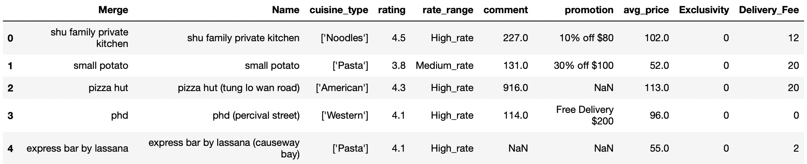
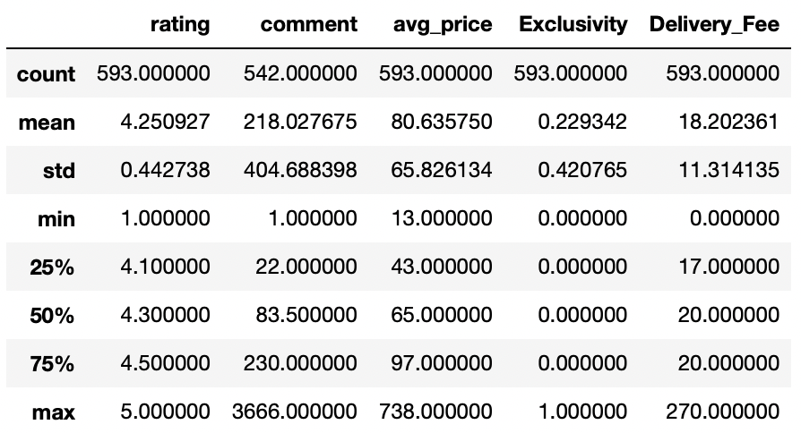
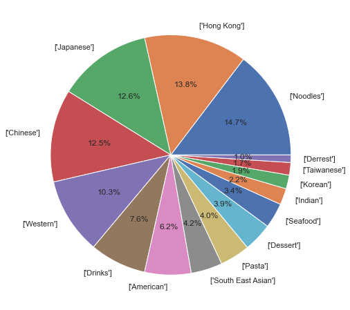
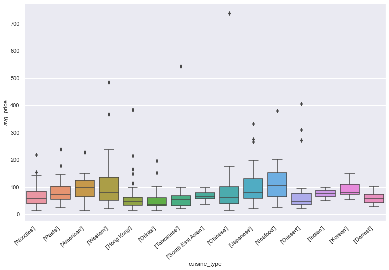
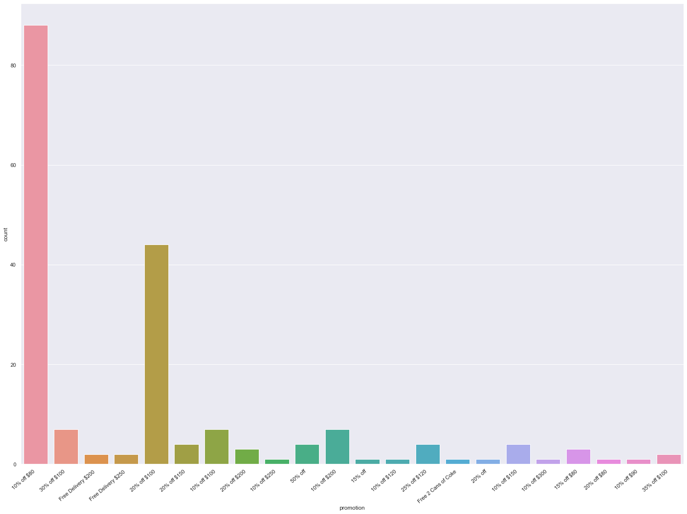
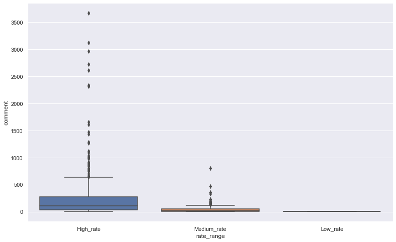
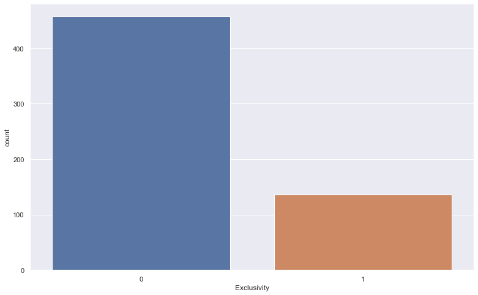
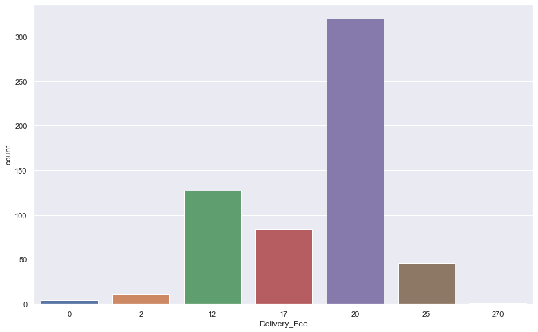

# foodpanda_HK
this is a project completed with other two teammate.
maily focused on HK delivery platfroms analysis in Tin Hau area - foodpanda, Delvieroo and Uber Eats

# HOW
We did web scraping with selenium from three platfroms Tin Hau page, and used beautifulsoup to get all the data we needed, like restuarant name, delivery fee, promotion, number of rating etc.

# AIMS
* restuarant selection 
* quantity of promotion
* less delivery fee
* any other correlation 

# foodpanda finding

* df.shape(593,10)
----------------------------------------------------------------------------------

* Mean - delivery fee = 18.2
* Mean - Rating =4.25
* Mean - average price = HKD 81
----------------------------------------------------------------------------------

* In Tin Hau area, foodpanda restaurant selection are mainly focused on Asia cuisines type

* Western and Seafood are more expensive. Chinese food has the largest outliner, which could represent that there are some luxury Chinese food within Tin Hau area on foodpanda
----------------------------------------------------------------------------------

* There are 47% of restaurants are doing promotion on foodpanda in Tin Hau. 10% off $80 is the most frequency use, 47% restaurants are using it. 
----------------------------------------------------------------------------------

* rating < 2 = Low_rate
* rating > 2 & <=4 = Medium_rate
* rating > 4 = High_rate
* Restaurants with High_rate would have chance to gain comments when eaters provide feedback
* There are two assumption about low_rate, eaters never hit rating less than 2 or foodpanda auto hidden all the low rating.
----------------------------------------------------------------------------------

* 0 = non-exclusive with foodpanda
* 1= exclusive with foodpanda
----------------------------------------------------------------------------------

* Delivery fee mostly are $20, only 4 restaurants are offering free delivery. And 4 of them are required eaters order around 200HKD amount to get the offer
